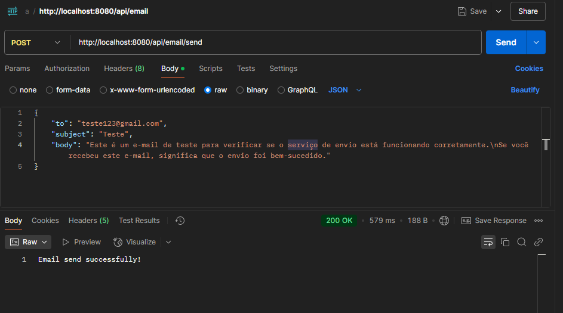
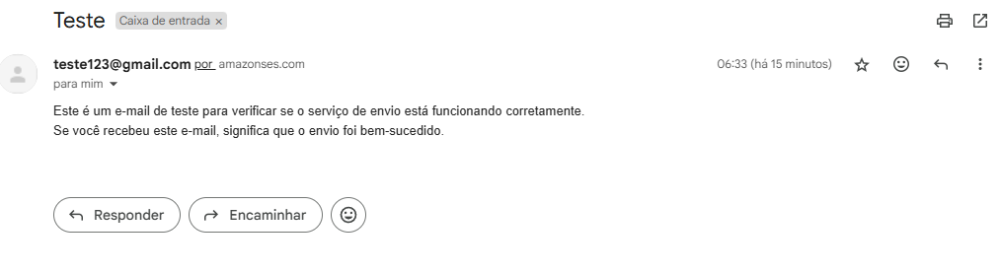
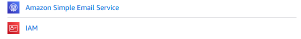

# Projeto de API de Envio de Emails (Desafio de Vaga Backend - Uber)

<p align="center">
  
  
</p>

Este projeto é um **DESAFIO** de vaga para desenvolvedor **BACKEND** da **Uber**. O desafio aborda **Java Spring** e **Arquitetura Limpa**, aplicados na criação de uma API RESTful para o envio de emails utilizando o Amazon Simple Email Service (SES). Com o uso do Spring Boot, a aplicação permite que os usuários enviem emails de forma programática, garantindo confiabilidade e escalabilidade. Essa solução é ideal para sistemas que necessitam de notificações automáticas ou comunicação por email.

Por se tratar de um desafio/teste, o envio de emails está restrito apenas a endereços previamente verificados no AWS SES. Entretanto, caso você mova a conta para o modo de produção e solicite a remoção dessa limitação junto à AWS, a API poderá enviar emails para qualquer destinatário, tornando-se uma solução totalmente funcional em um ambiente real.

### Funcionalidades:

- **Envio de Emails (POST):** Permite o envio de emails especificando o destinatário, assunto e corpo da mensagem.  
- **Tratamento de Exceções:** Implementa tratamento de erros personalizados para garantir que falhas no envio sejam devidamente identificadas.  
- **Integração com AWS SES:** Utiliza o serviço da Amazon para garantir alta taxa de entrega e confiabilidade.

# 💻 Requisitos
- **Java** (versão 17 ou superior)
- **Maven** (gerenciamento de dependências e construção do projeto)
- **Conta AWS** (com SES configurado e email verificado)

# ⬇️ Instalação do Projeto
## Primeiro você deve clonar o repositório

```bash
## Clone o repositório
https://github.com/LeoAlves02/email-service

## Acesse-o
cd email-service
```

Para instalar as dependências, execute o seguinte comando:

```bash
mvn install
```

# 🚀 Configuração do AWS SES e IAM



Para que a API funcione corretamente, é necessário configurar o Amazon SES e o IAM na AWS:

## 1️⃣ Criar um Usuário IAM

1. Acesse o **AWS IAM** (https://console.aws.amazon.com/iam/).
2. Vá para **Usuários** > **Adicionar usuário**.
3. Defina um nome e selecione **Acesso Programático**.
4. Em **Permissões**, selecione **Anexar políticas diretamente** e procure por `AmazonSESFullAccess`.
5. Conclua a criação do usuário e guarde as credenciais (Access Key e Secret Key).

## 2️⃣ Configurar o Amazon SES

1. Acesse o **AWS SES** (https://console.aws.amazon.com/ses/).
2. Vá para **Verified Identities** e adicione um email para verificação.
3. Aguarde a confirmação do email antes de utilizá-lo.

## 3️⃣ Alterar Configurações no Projeto

Edite o arquivo `application.properties` para incluir as credenciais do AWS IAM e o email verificado no SES:

```properties
aws.region= 
aws.accessKeyId= 
aws.secretKey= 
```

Além disso, na classe **`SesEmailSender.java`** dentro da pasta **`infra/ses`**, no método sendEmail, altere o remetente para o email verificado no SES:

```java
.withSource("destinatario@gmail.com")
```

# 🚀 Como Executar o Projeto

Após configurar o projeto e as credenciais, execute o projeto com o seguinte comando:

```bash
mvn spring-boot:run
```

Quando o servidor estiver em funcionamento, você pode testar a API enviando um **POST request** para o endpoint `http://localhost:8080/api/email/send` com o corpo do request em JSON. Exemplo:

```json
{
  "toEmail": "destinatario@exemplo.com",
  "subject": "Assunto do Email",
  "body": "Conteúdo do email enviado pela API."
}
```

Isso irá acionar a função de envio de email. Você verá uma resposta de sucesso se o envio for bem-sucedido.

---

